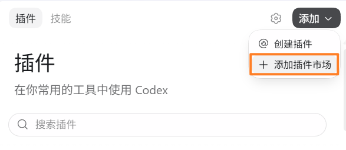
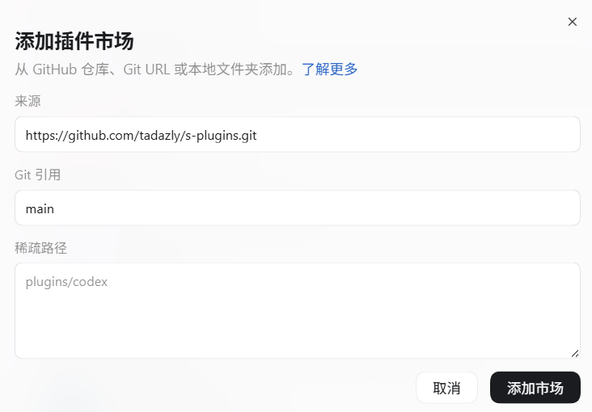
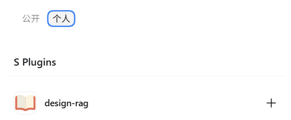

# S Plugins

面向 Agents 的插件集合。

## 安装与使用

### Codex 桌面端

> 以下为 Codex 桌面端真实截图，界面可能随版本变化。

1. 打开 **插件**，点击右上角 **添加**，选择 **添加插件市场**。

   

2. 在 **来源** 中填写 `https://github.com/tadazly/s-plugins.git`，**Git 引用**填写 `main`，**稀疏路径**留空，然后点击 **添加市场**。

   

3. 返回插件页，点击 **个人**，从 **S Plugins** 中选择要安装的插件。

   

4. 新建 Codex 任务后直接描述需求；需要明确指定时，可输入 `@` 选择插件或 Skill。

### Codex CLI

```powershell
codex plugin marketplace add tadazly/s-plugins
codex plugin marketplace list
```

运行 `/plugins` 浏览并安装插件；安装完成后新建 CLI 会话。

### Claude Code

```powershell
claude plugin marketplace add tadazly/s-plugins
claude plugin install design-rag@s-plugins
```

也可以在会话中运行 `/plugin marketplace add tadazly/s-plugins`，再到 `/plugin` 的 **Discover** 页浏览安装。安装完成后新建会话；已打开的会话可运行 `/reload-plugins`。

第三方市场默认不自动更新，更新已安装插件：

```powershell
claude plugin marketplace update s-plugins
claude plugin update design-rag@s-plugins
```

也可以在 `/plugin` → **Marketplaces** 中为 `s-plugins` 开启自动更新。

### WorkBuddy

> WorkBuddy 端尚未验收。

WorkBuddy 使用 CodeBuddy 插件体系，读取本仓库的 `.codebuddy-plugin/marketplace.json`。在插件市场中添加 Git 市场 `https://github.com/tadazly/s-plugins.git`；使用 CodeBuddy Code CLI 时：

```text
/plugin marketplace add tadazly/s-plugins
/plugin install design-rag@s-plugins
```

## 插件目录

| 插件 | 简介 |
| --- | --- |
| [DRAG 游戏策划知识库](<https://github.com/tadazly/design-rag>) | 检索本地策划案、配表和历史版本 |
| [Egret Agent Inspector](<https://github.com/tadazly/egret-agent-inspector>) | 查询、操作和测试浏览器中的 Egret 游戏 |

## 发布插件

新插件建议从 [plugin-template](https://github.com/tadazly/plugin-template) 创建。模板内置三端清单生成与校验、agent 制作与发布技能，以及发布后通知本仓库的 CI/CD；按模板说明配置 `S_PLUGINS_DISPATCH_TOKEN` 即可接入。

### 从其他仓库自动发布

插件仓库完成构建、测试、tag 和发布后，向本仓库发送 `plugin-released` 类型的 `repository_dispatch`：

```text
上游发布成功
  → repository_dispatch
  → 更新 .agents/plugins/marketplace.json
  → 生成 Claude Code / WorkBuddy marketplace 与 README 插件目录
  → 静态校验
  → github-actions[bot] 提交 main
```

通知参数：

| 参数 | 首次登记 | 后续发布 | 说明 |
| --- | --- | --- | --- |
| `name` | 必填 | 必填 | 稳定的插件 ID，小写 kebab-case |
| `version` | 必填 | 必填 | 插件版本，使用 SemVer，不带 `v` |
| `source.ref` | 必填 | 必填 | 已发布的 Git tag 或 ref |
| `source.url` | 必填 | 可省略 | 插件仓库 HTTPS URL；登记后不可由通知修改 |
| `source.path` | 必填 | 可省略 | 插件目录，以 `./` 开头；登记后不可由通知修改 |
| `description` | 必填 | 可选 | 插件包说明，Codex 与 Claude Code 共用 |
| `interface.displayName` | 必填 | 可选 | Codex、Claude Code 与 README 中显示的名称 |
| `interface.shortDescription` | 必填 | 可选 | Codex 与 README 中显示的简短说明 |
| `interface.longDescription` | 必填 | 可选 | 插件详情中的完整说明 |
| `interface.developerName` | 必填 | 可选 | 开发者名称，Claude Code 中为 `author.name` |
| `interface.websiteURL` | 必填 | 可选 | 插件网站或仓库的 HTTPS URL，Claude Code 中为 `homepage` |

`policy.installation`、`policy.authentication` 和 `category` 由本仓库管理，不接受发布通知覆盖。首次登记必须提供全部参数；后续发布至少提供 `name`、`version` 和 `source.ref`，其他字段仅在传入时更新。

Claude Code 与 WorkBuddy marketplace 不单独接收通知，由同一次更新从 Codex 条目生成：只保留各自 schema 支持的字段（WorkBuddy 只写 CodeBuddy 文档列出的字段），`source.path` 去掉 `./` 前缀，`policy.installation` 为 `NOT_AVAILABLE` 的插件不列出。

**可省略参数不可变更**，确需迁移来源时，应在本仓库中人工修改并审核，而不是通过普通版本发布通知变更。

首次登记示例：

```json
{
  "event_type": "plugin-released",
  "client_payload": {
    "name": "design-rag",
    "version": "0.3.0",
    "description": "DRAG 本地游戏策划案与配置表检索、分析和索引管理工具",
    "source": {
      "url": "https://github.com/tadazly/design-rag.git",
      "path": "./plugins/design-rag",
      "ref": "v0.3.0"
    },
    "interface": {
      "displayName": "DRAG 游戏策划知识库",
      "shortDescription": "检索本地策划案、配表和历史版本",
      "longDescription": "使用本地只读索引模糊查找游戏策划案与配置表，分析玩法、流程、产出逻辑、历史改动和活动复用，并管理资料来源与增量索引。",
      "developerName": "tadazly",
      "websiteURL": "https://github.com/tadazly/design-rag"
    }
  }
}
```

后续版本的最小通知：

```json
{
  "event_type": "plugin-released",
  "client_payload": {
    "name": "design-rag",
    "version": "0.3.1",
    "source": {
      "ref": "v0.3.1"
    }
  }
}
```

如果展示信息发生变化，在后续 payload 中附带变化的 `description` 或 `interface` 字段即可。

#### 支持 Claude Code 与 WorkBuddy

发布通知无需额外字段。WorkBuddy 使用的 CodeBuddy 插件体系兼容 Claude Code 插件规范，识别 `.claude-plugin/plugin.json` 与 `${CLAUDE_PLUGIN_ROOT}`，因此两端共用一份清单。发布的 tag 需满足：

- 插件目录包含 `.claude-plugin/plugin.json`，`name`、`version` 与 `.codex-plugin/plugin.json` 一致。marketplace 条目的 `version` 决定 Claude Code 的缓存目录和更新判断。
- MCP server 在 `.claude-plugin/plugin.json` 中内联声明，`command` 和 `args` 使用 `${CLAUDE_PLUGIN_ROOT}` 定位插件文件。
- Claude Code 与 WorkBuddy 也会加载插件根目录的 `.mcp.json`：Claude Code 中其相对路径按用户会话目录解析、`cwd` 不生效，同名 server 以 `plugin.json` 的内联声明为准。因此将 Codex 配置改名（如 `.codex-mcp.json`），并在 `.codex-plugin/plugin.json` 的 `mcpServers` 中引用。
- `skills/` 两端通用，无需改动。

#### 发布仓库发送通知

创建仅授权 `tadazly/s-plugins`、具有 `Contents: Read and write` 权限的 fine-grained personal access token，并在插件仓库中保存为 Secret `S_PLUGINS_DISPATCH_TOKEN`。不要把 Token 写入 workflow、脚本或日志。

将以下步骤放在发布 job 的最后。示例直接读取插件 manifest，避免重复维护展示信息：

```yaml
- name: Notify s-plugins
  env:
    GH_TOKEN: ${{ secrets.S_PLUGINS_DISPATCH_TOKEN }}
    PLUGIN_MANIFEST: plugins/design-rag/.codex-plugin/plugin.json
    PLUGIN_SOURCE_URL: https://github.com/tadazly/design-rag.git
    PLUGIN_SOURCE_PATH: ./plugins/design-rag
    PLUGIN_WEBSITE_URL: https://github.com/tadazly/design-rag
  shell: bash
  run: |
    jq -n \
      --slurpfile plugin "$PLUGIN_MANIFEST" \
      --arg ref "$GITHUB_REF_NAME" \
      --arg url "$PLUGIN_SOURCE_URL" \
      --arg path "$PLUGIN_SOURCE_PATH" \
      --arg website "$PLUGIN_WEBSITE_URL" \
      '{
        event_type: "plugin-released",
        client_payload: {
          name: $plugin[0].name,
          version: $plugin[0].version,
          description: $plugin[0].description,
          source: {url: $url, path: $path, ref: $ref},
          interface: {
            displayName: $plugin[0].interface.displayName,
            shortDescription: $plugin[0].interface.shortDescription,
            longDescription: $plugin[0].interface.longDescription,
            developerName: $plugin[0].interface.developerName,
            websiteURL: ($plugin[0].interface.websiteURL // $website)
          }
        }
      }' | gh api --method POST repos/tadazly/s-plugins/dispatches --input -
```

重复发送相同内容不会产生新提交。通知表示上游已经完成发布验收，本仓库不会重新构建或测试上游插件。

#### 给发布仓库 Agent 的提示词

```text
当前插件发布成功后，向 tadazly/s-plugins 发送 plugin-released repository_dispatch。首次登记从插件 manifest 读取 name、version、description 和 interface 展示信息，并附带 source.url、source.path、source.ref；后续至少发送 name、version、source.ref，展示信息变化时再附带相应字段。使用仓库 Secret S_PLUGINS_DISPATCH_TOKEN，只有 tag 和 release 成功后才通知，禁止输出或提交 Token。插件支持 Claude Code 时，按“支持 Claude Code”要求在 tag 中提供 .claude-plugin/plugin.json，并在发布校验中确认其 version 与 Codex manifest 一致。按 https://github.com/tadazly/s-plugins/blob/main/README.md 的“从其他仓库自动发布”协议实施并验证。
```

### 在本仓库添加插件

本地插件源码放在 `plugins/<plugin-name>/`：

1. 使用 Codex 内置 `$plugin-creator` 创建插件及 `local` marketplace 条目。
2. 将 manifest 的 `version`、`description` 和 `interface` 展示字段同步到 marketplace 条目。
3. 需要支持 Claude Code 时，按“支持 Claude Code”补充 `.claude-plugin/plugin.json`。
4. 运行 `python scripts/sync_generated.py` 更新 Claude Code marketplace 与插件目录。
5. 使用 `plugin-creator` validator 验证插件，Claude Code 插件再运行 `claude plugin validate plugins/<plugin-name>`，最后运行本仓库检查。

每个本地插件必须包含 `.codex-plugin/plugin.json`；`skills/`、`hooks/`、`assets/`、`.mcp.json` 和 `.app.json` 均位于插件根目录。

## 开发与验证

```powershell
python scripts/sync_generated.py
python scripts/validate_repo.py
python -m unittest discover -s tests -v
claude plugin validate .
```

本地调试 marketplace：

```powershell
codex plugin marketplace add .
claude plugin marketplace add .
```

关键文件：

- `.agents/plugins/marketplace.json`：插件来源、安装策略和展示信息的唯一数据源。
- `.claude-plugin/marketplace.json`、`.codebuddy-plugin/marketplace.json`：Claude Code 与 WorkBuddy marketplace，由脚本生成，不手工编辑。
- `scripts/validate_repo.py`：校验与生成规则；`GENERATED_MARKETPLACES` 登记各平台的生成函数，新增平台只需在此加一项。
- `scripts/update_marketplace.py`：处理发布通知，更新全部 marketplace 与 README。
- `scripts/sync_generated.py`：重建全部生成文件；`--list-outputs` 列出生成文件，供 workflow 提交。
- `.github/workflows/update-marketplace.yml`：自动更新并提交。
- `.github/workflows/smoke.yml`：用真实 Claude Code CLI 安装全部插件，只报告不阻断。

## 参考

- [OpenAI：使用和安装插件](https://learn.chatgpt.com/zh-Hans/docs/plugins)
- [OpenAI：Package your plugin](https://developers.openai.com/plugins/build/plugins)
- [Claude Code：Discover and install plugins](https://code.claude.com/docs/en/discover-plugins)
- [Claude Code：Create and distribute a plugin marketplace](https://code.claude.com/docs/en/plugin-marketplaces)
- [Claude Code：Plugins reference](https://code.claude.com/docs/en/plugins-reference)
- [CodeBuddy：插件市场](https://www.codebuddy.ai/docs/zh/cli/plugin-marketplaces)
- [CodeBuddy：插件参考](https://www.codebuddy.ai/docs/zh/cli/plugins-reference)
